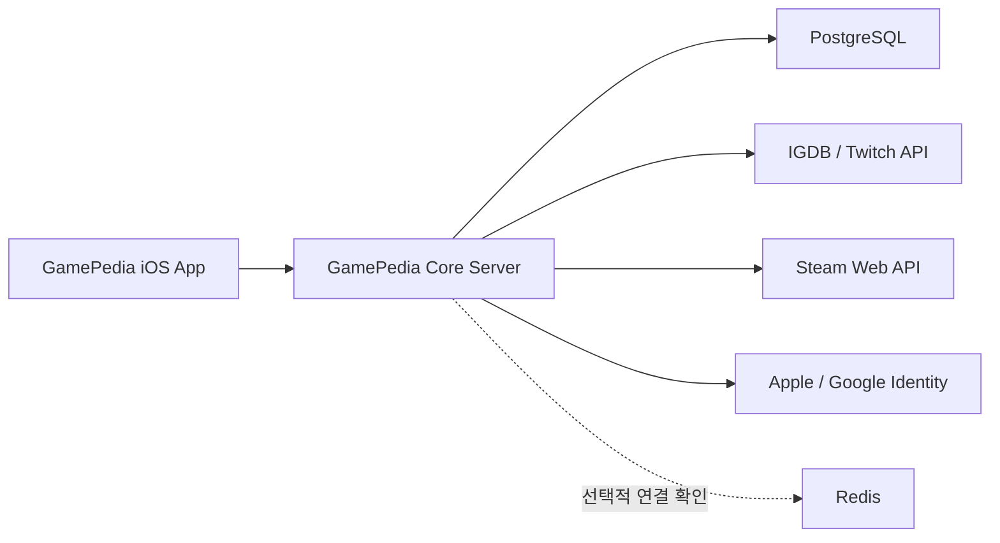

# GamePedia Core Server

GamePedia iOS 앱을 위한 핵심 백엔드 서버입니다.  
이 서버는 게임 정보 조회, 리뷰, 찜(즐겨찾기), 사용자 인증(Auth), 라이브러리, 검색 기록 저장, 신고/차단 등의 기능을 제공합니다.

중요한 전제는 다음과 같습니다.

- 이 프로젝트는 별도의 Auth Server가 있는 구조가 아닙니다.
- 인증 기능은 Core Server 내부 모듈과 서비스로 함께 포함되어 있습니다.
- 번역은 더 이상 기본 서버 렌더링 경로에 포함되지 않으며, Core Server는 원문 데이터를 canonical source로 반환합니다.
- 이 README는 현재 저장소의 실제 코드 구조를 기준으로 작성되었습니다.

## 1. 프로젝트 개요

GamePedia Core Server는 Express 기반의 Node.js API 서버입니다.  
PostgreSQL + Prisma ORM을 사용해 사용자, 세션, 리뷰, 찜, 신고, 검색 기록, 라이브러리 상태 데이터를 관리하고, JWT 기반 인증과 외부 게임 데이터/소셜 로그인 연동을 제공합니다.

현재 서버가 담당하는 주요 영역:

- 이메일/비밀번호 회원가입 및 로그인
- Apple / Google 소셜 로그인
- JWT Access Token / Refresh Token 발급 및 갱신
- IGDB 기반 게임 목록/상세/검색/추천 조회
- 게임 리뷰 작성 및 조회
- 찜(즐겨찾기) 추가/삭제/조회
- 내 라이브러리 집계 조회
- Steam 계정 연동 및 최근 플레이 게임 조회
- 플레이 중 / 완료 / 중단 상태 관리
- 검색 기록 저장
- 신고 / 유저 차단
- 프로필 조회 및 프로필 이미지 관리

### 기술 스택

- Node.js
- Express
- Prisma ORM
- PostgreSQL
- JWT Authentication
- Redis
  - 선택 구성, 현재 코드는 연결 점검 중심
- PM2
- AWS EC2 배포

## 2. 전체 시스템 구조



역할 분리는 다음과 같습니다.

- `iOS App`
  - 사용자 인터페이스 제공
  - 로그인 이후 Access Token을 `Authorization: Bearer <token>` 형태로 전송
  - Steam 연동 시 Core Server가 내려주는 링크를 열고 결과를 다시 앱 플로우로 연결
- `GamePedia Core Server`
  - 비즈니스 로직의 중심
  - 인증, 세션, 라이브러리, 리뷰, 찜, 검색, 신고, 유저 프로필 처리
  - 외부 API 호출과 DB 저장 담당
- `PostgreSQL`
  - 영속 데이터 저장소
- `Redis`
  - 현재 코드 기준으로는 필수 인프라가 아니며, 서버 시작 시 연결 가능 여부를 점검하는 선택 구성

## 3. 주요 기능

### 3.1 사용자 인증

- 이메일/비밀번호 회원가입
- 이메일/비밀번호 로그인
- Apple 로그인
- Google 로그인
- Refresh Token Rotation
- 로그아웃 시 세션 폐기
- 비밀번호 재설정 토큰 발급 및 사용

인증 관련 엔드포인트는 [`src/routes/auth.routes.js`](/Users/hwangseokbeom/Documents/GitHub/GamePediaCoreServer/src/routes/auth.routes.js)에 정의되어 있습니다.

### 3.2 게임 정보 조회

- 하이라이트 게임 조회
- 인기 게임 조회
- 추천 게임 조회
- 게임 검색
- 게임 자동완성 제안
- 게임 상세 조회

게임 정보는 현재 [`src/modules/igdb/`](/Users/hwangseokbeom/Documents/GitHub/GamePediaCoreServer/src/modules/igdb) 모듈이 담당합니다.  
즉, 개념적으로는 `game` 도메인이지만 실제 구현은 IGDB 연동 중심으로 분리되어 있습니다.

### 3.3 리뷰 작성 및 조회

- 리뷰 작성
- 특정 게임의 리뷰 목록 조회
- 내 리뷰 목록 조회
- 리뷰 수정 / 삭제

리뷰 데이터는 `reviews` 테이블에 저장되며, 사용자 본인 소유 검증을 통해 수정/삭제 권한을 통제합니다.

### 3.4 찜(즐겨찾기)

- 게임 찜 추가
- 게임 찜 삭제
- 내 찜 목록 조회
- 특정 게임의 찜 여부 확인

찜 기능은 `favorite_games` 테이블을 기반으로 동작하며, 라이브러리 응답에서도 그대로 재사용됩니다.

### 3.5 플레이 중 게임 관리

라이브러리 기능은 다음 데이터를 함께 묶어서 제공합니다.

- 최근 플레이한 게임
  - Steam 연동 계정 기준
- 플레이 중
  - 사용자가 직접 관리하는 상태
- 찜한 게임
  - 기존 `favorite_games`
- 리뷰 작성함
  - 기존 `reviews`

또한 다음 기능을 포함합니다.

- 내 라이브러리 집계 조회
- Steam 계정 연동 / 해제
- 플레이 중 / 완료 / 중단 상태 저장

### 3.6 검색 기록 저장

검색어 자체는 [`src/modules/igdb/igdb.service.js`](/Users/hwangseokbeom/Documents/GitHub/GamePediaCoreServer/src/modules/igdb/igdb.service.js) 내부에서 처리되고,  
정규화된 검색어와 결과 수는 `search_queries` 테이블에 기록됩니다.

### 3.7 신고 및 차단

- 리뷰/댓글/유저 신고
- 특정 유저 차단 / 차단 해제
- 차단 유저의 리뷰를 목록에서 숨기는 moderation hook 포함

## 4. 실제 프로젝트 구조

아래는 현재 저장소 기준의 실제 구조입니다.

```text
GamePediaCoreServer/
├── docs/
│   └── cicd.md
├── prisma/
│   ├── schema.prisma
│   └── migrations/
├── scripts/
│   └── server/
│       ├── bootstrap-clones.sh
│       └── deploy-instance.sh
├── src/
│   ├── app.js
│   ├── server.js
│   ├── config/
│   │   ├── env.js
│   │   ├── load-env.js
│   │   ├── prisma.js
│   │   └── redis.js
│   ├── controllers/
│   │   └── auth.controller.js
│   ├── middlewares/
│   │   ├── auth.middleware.js
│   │   ├── error.middleware.js
│   │   └── validate.middleware.js
│   ├── modules/
│   │   ├── favorite/
│   │   ├── igdb/
│   │   ├── library/
│   │   ├── moderation/
│   │   ├── search/
│   │   ├── review/
│   │   └── user/
│   ├── routes/
│   │   └── auth.routes.js
│   ├── services/
│   │   ├── apple-auth.service.js
│   │   ├── auth.service.js
│   │   ├── email.service.js
│   │   ├── google-auth.service.js
│   │   ├── password-reset-email.service.js
│   │   ├── password.service.js
│   │   ├── search-log.service.js
│   │   ├── search-query-translation.service.js
│   │   ├── steam.service.js
│   │   └── token.service.js
│   ├── utils/
│   │   ├── api-response.js
│   │   ├── async-handler.js
│   │   ├── auth-error.js
│   │   ├── error-response.js
│   │   └── logger.js
│   └── validators/
│       └── auth.validator.js
├── ecosystem.config.js
├── deploy.sh
├── deploy-staging.sh
├── prisma.config.js
├── .env.production
├── .env.staging
├── .env.production.example
└── .env.staging.example
```

주의할 점:

- 인증은 `src/routes`, `src/controllers`, `src/services`, `src/validators`에 분산된 전통적 계층 구조입니다.
- 나머지 도메인은 `src/modules/*` 형태로 분리되어 있습니다.
- 즉, 이 프로젝트는 인증만 따로 서버로 분리된 구조가 아니라, Core Server 안에 Auth 기능이 내장된 혼합 구조입니다.

## 5. 아키텍처 설명

### 5.1 Controller

Controller는 HTTP 요청과 서비스 호출 사이의 얇은 계층입니다.

- 요청에서 필요한 값을 꺼냄
- 인증 정보(`req.auth`) 전달
- 서비스 반환값을 `successResponse()`로 감싸 응답
- HTTP 상태 코드 결정

예:

- `src/controllers/auth.controller.js`
- `src/modules/review/review.controller.js`
- `src/modules/library/library.controller.js`

### 5.2 Service

Service는 핵심 비즈니스 로직을 담당합니다.

- Prisma를 통한 DB 조회/저장
- 외부 API 호출
- 권한 검증
- 상태 전이 처리
- DTO 매핑 전 데이터 조립

예:

- `src/services/auth.service.js`
- `src/modules/igdb/igdb.service.js`
- `src/modules/review/review.service.js`
- `src/modules/library/library.service.js`
- `src/services/steam.service.js`

현재 코드베이스는 별도의 repository 레이어를 두지 않고, 서비스에서 Prisma를 직접 호출하는 방식입니다.

### 5.3 Prisma

Prisma는 PostgreSQL 스키마와 애플리케이션 모델 사이를 연결합니다.

대표 모델:

- `User`
- `RefreshToken`
- `PasswordResetToken`
- `SocialAccount`
- `Review`
- `FavoriteGame`
- `UserGameLibrary`
- `Report`
- `UserBlock`
- `SearchQuery`

스키마는 [`prisma/schema.prisma`](/Users/hwangseokbeom/Documents/GitHub/GamePediaCoreServer/prisma/schema.prisma)에서 관리하며, 실제 배포 시에는 `prisma migrate deploy`를 사용합니다.

### 5.4 Middleware

공통 처리 로직은 미들웨어로 분리되어 있습니다.

- `auth.middleware.js`
  - JWT Access Token 검증
  - 사용자 상태 확인
  - `req.auth` 설정
- `validate.middleware.js`
  - Zod 기반 입력 검증
- `error.middleware.js`
  - `AppError` 및 Prisma/업로드 에러 공통 응답 처리

### 5.5 JWT 인증 흐름

1. 사용자가 `/auth/signup`, `/auth/login`, `/auth/apple`, `/auth/google` 중 하나로 로그인합니다.
2. 서버는 Access Token + Refresh Token을 발급합니다.
3. Access Token은 클라이언트가 API 호출 시 Bearer 토큰으로 전송합니다.
4. 인증이 필요한 API는 `authenticateAccessToken` 미들웨어를 통과해야 합니다.
5. Refresh Token은 DB에 해시 형태로 저장됩니다.
6. `/auth/refresh` 호출 시 기존 Refresh Token을 폐기하고 새 토큰 쌍을 발급합니다.
7. `/auth/logout` 시 해당 Refresh Token 세션을 종료합니다.

## 6. 환경 변수 설명

환경 변수는 [`src/config/load-env.js`](/Users/hwangseokbeom/Documents/GitHub/GamePediaCoreServer/src/config/load-env.js)에 따라 다음 순서로 로드됩니다.

1. `.env`
2. `.env.local`
3. `.env.${NODE_ENV}`
4. `.env.${NODE_ENV}.local`

배포 스크립트와 Prisma CLI도 같은 순서를 기준으로 동작합니다. 운영 서버에서는 `.env.production` / `.env.staging` 에 공통값을 두고, 서버별 override 와 비밀값은 `.env.production.local` / `.env.staging.local` 로 분리하는 것을 권장합니다.

### 6.1 핵심 서버/DB

| 변수 | 설명 | 필수 |
| --- | --- | --- |
| `NODE_ENV` | 실행 환경 (`development`, `production`, `staging`, `test`) | 예 |
| `HOST` | 서버 바인딩 호스트 | 아니오 |
| `PORT` | 서버 포트 | 예 |
| `DATABASE_URL` | PostgreSQL 연결 문자열 | 예 |

### 6.2 JWT / 인증

| 변수 | 설명 | 필수 |
| --- | --- | --- |
| `JWT_ACCESS_SECRET` | Access Token 서명 키 | 예 |
| `JWT_REFRESH_SECRET` | Refresh Token 서명 키 | 예 |
| `ACCESS_TOKEN_EXPIRES_IN` | Access Token 만료 시간 | 예 |
| `REFRESH_TOKEN_EXPIRES_IN` | Refresh Token 만료 시간 | 예 |
| `BCRYPT_SALT_ROUNDS` | bcrypt salt rounds | 예 |
| `PASSWORD_RESET_TOKEN_TTL_MINUTES` | 비밀번호 재설정 토큰 TTL(분) | 예 |

### 6.3 앱/공개 URL

| 변수 | 설명 | 필수 |
| --- | --- | --- |
| `APP_WEB_BASE_URL` | 앱/웹 기준 베이스 URL | 운영 필수 |
| `API_PUBLIC_BASE_URL` | 외부에서 접근 가능한 Core Server URL. Steam callback URL 생성에 사용 | Steam 사용 시 권장 |
| `MOBILE_APP_STEAM_CALLBACK_URL` | Steam 연동 완료 후 iOS 앱으로 되돌릴 커스텀 URL 스킴 | Steam 사용 시 권장 |

### 6.4 메일

| 변수 | 설명 | 필수 |
| --- | --- | --- |
| `MAIL_MODE` | `log` 또는 `smtp` | 예 |
| `MAIL_HOST` | SMTP 호스트 | `MAIL_MODE=smtp`일 때 |
| `MAIL_PORT` | SMTP 포트 | `smtp`일 때 |
| `MAIL_SECURE` | TLS 사용 여부 | `smtp`일 때 |
| `MAIL_USER` | SMTP 계정 | `smtp`일 때 |
| `MAIL_PASSWORD` | SMTP 비밀번호 | `smtp`일 때 |
| `MAIL_FROM` | 발신 주소 | `smtp`일 때 |
| `EMAIL_FROM_ADDRESS` | `MAIL_FROM` 대체용 호환 변수 | 아니오 |

### 6.5 소셜 로그인 / 외부 API

| 변수 | 설명 | 필수 |
| --- | --- | --- |
| `APPLE_CLIENT_ID` | Apple 로그인 검증용 Client ID | Apple 로그인 사용 시 |
| `GOOGLE_CLIENT_ID` | Google 로그인 검증용 Client ID | Google 로그인 사용 시 |
| `STEAM_API_KEY` | Steam Web API Key | Steam 라이브러리 사용 시 |
| `STEAM_WEB_API_BASE_URL` | Steam Web API base URL. 기본값은 `https://api.steampowered.com/` | 선택 |
| `TWITCH_CLIENT_ID` | IGDB 접근용 Twitch Client ID | 게임 API 사용 시 |
| `TWITCH_CLIENT_SECRET` | IGDB 접근용 Twitch Client Secret | 게임 API 사용 시 |

### 6.6 기타

| 변수 | 설명 | 필수 |
| --- | --- | --- |
| `REDIS_URL` | Redis 연결 문자열. 현재는 부팅 시 연결 점검 용도 | 선택 |
| `PROFILE_IMAGE_MAX_SIZE_BYTES` | 업로드 가능한 프로필 이미지 최대 크기 | 예 |

### 6.7 예시 파일

- 로컬 개발 기준: [`.env.example`](/Users/hwangseokbeom/Documents/GitHub/GamePediaCoreServer/.env.example)
- production 기준: [`.env.production.example`](/Users/hwangseokbeom/Documents/GitHub/GamePediaCoreServer/.env.production.example)
- staging 기준: [`.env.staging.example`](/Users/hwangseokbeom/Documents/GitHub/GamePediaCoreServer/.env.staging.example)

현재 운영 기준값은 다음과 같습니다.

- production: `PORT=3001`, `DATABASE_URL -> gamepedia_core`, `https://gamepedia-api.duckdns.org`
- staging: `PORT=3101`, `DATABASE_URL -> gamepedia_core_staging`, `https://staging-gamepedia-api.duckdns.org`

## 7. 설치 및 실행

### 7.1 로컬 개발

```bash
npm install
npx prisma generate
npx prisma migrate dev
npm run dev
```

### 7.2 프로덕션 / 스테이징 실행

```bash
cd ~/GamePediaCoreServer-prod
./deploy.sh

cd ~/GamePediaCoreServer-staging
./deploy-staging.sh
```

### 7.3 PM2 설정

[`ecosystem.config.js`](/Users/hwangseokbeom/Documents/GitHub/GamePediaCoreServer/ecosystem.config.js)에는 현재 다음 프로세스가 정의되어 있습니다.

- `core-server`
- `core-server-staging`

운영 서버에서 위 프로세스는 기본적으로 다음 `cwd` 를 사용하도록 맞춰져 있습니다.

- `core-server` -> `~/GamePediaCoreServer-prod`
- `core-server-staging` -> `~/GamePediaCoreServer-staging`

이 `cwd` 가 어긋나면 배포 스크립트가 자동으로 실패시키거나 recreate 합니다.

## Search Notes

- 검색은 서버 번역이 아니라 `normalize -> locale alias resolve -> candidate generation -> IGDB fetch -> rerank` 순서로 동작합니다.
- alias 사전은 [`src/modules/search/aliases/`](/Users/hwangseokbeom/Documents/GitHub/GamePediaCoreServer/src/modules/search/aliases) 아래 locale별 파일로 관리합니다.
- 운영용 상세 검색 로그는 [`logs/search/search-queries.ndjson`](/Users/hwangseokbeom/Documents/GitHub/GamePediaCoreServer/logs/search/search-queries.ndjson) 에 append 됩니다.
- 과거 `search-query-translation.service.js` 이름은 유지하지만, 현재 구현은 번역기가 아니라 alias-aware query resolver입니다.

## 8. 배포 방법

현재 실제 운영 배포 기준은 [`docs/manual-deploy.md`](/Users/hwangseokbeom/Documents/GitHub/GamePediaCoreServer/docs/manual-deploy.md)입니다.

현재 기준 요약:

- 운영자는 로컬에서 `dev -> staging -> main` 순서로 머지합니다.
- EC2 에 SSH 접속해 `git fetch` + `git reset --hard origin/<branch>` + `pm2 restart` 방식으로 수동 배포합니다.
- `staging` 검증 성공 후에만 `production` 을 반영합니다.
- nginx 는 `gamepedia-api.duckdns.org -> 127.0.0.1:3001`, `staging-gamepedia-api.duckdns.org -> 127.0.0.1:3101`
- self-hosted runner 자동배포는 현재 비활성화 상태이며, 참고용 문서는 [`docs/cicd.md`](/Users/hwangseokbeom/Documents/GitHub/GamePediaCoreServer/docs/cicd.md)입니다.
- runner 설치/서비스화 참고는 [`docs/runner-setup.md`](/Users/hwangseokbeom/Documents/GitHub/GamePediaCoreServer/docs/runner-setup.md)에서 확인합니다.

## 9. API 구조 개요

공통 응답 형식:

```json
{
  "success": true,
  "data": {}
}
```

에러 형식:

```json
{
  "success": false,
  "error": {
    "code": "ERROR_CODE",
    "message": "Readable message"
  }
}
```

### 9.1 Health

- `GET /health`

### 9.2 Auth

- `POST /auth/signup`
- `POST /auth/login`
- `POST /auth/apple`
- `POST /auth/google`
- `POST /auth/forgot-password`
- `POST /auth/reset-password`
- `POST /auth/refresh`
- `POST /auth/logout`
- `GET /auth/me`
- `DELETE /auth/me`

### 9.3 User

- `GET /users/me`
- `PATCH /users/me`
- `PATCH /users/me/profile-image`
- `DELETE /users/me/profile-image`
- `PATCH /auth/me`
- `PATCH /auth/me/profile-image`
- `DELETE /auth/me/profile-image`

### 9.4 Game / IGDB

- `GET /games/highlights`
- `GET /games/popular`
- `GET /games/recommended`
- `GET /games/search`
- `GET /games/suggestions`
- `GET /games/:id`

### 9.5 Review

- `POST /reviews`
- `GET /games/:gameId/reviews`
- `PATCH /reviews/:reviewId`
- `DELETE /reviews/:reviewId`
- `GET /users/me/reviews`

### 9.6 Favorite

- `POST /favorites`
- `DELETE /favorites/:gameId`
- `GET /users/me/favorites`
- `GET /games/:gameId/favorite-status`

### 9.7 Library

- `GET /users/me/library`
- `POST /users/me/library/status`
- `POST /users/me/library/steam/link`
- `DELETE /users/me/library/steam/link`
- `GET /library/steam/callback`

### 9.8 Moderation

- `POST /reports`
- `POST /users/:userId/block`
- `DELETE /users/:userId/block`

## 10. iOS 앱과의 연동 방식

기본 연동 방식:

1. iOS 앱이 로그인/회원가입 API를 호출합니다.
2. Core Server는 Access Token / Refresh Token을 발급합니다.
3. 앱은 Access Token을 저장하고 인증이 필요한 요청에 Bearer 토큰으로 포함합니다.
4. Access Token 만료 시 `/auth/refresh`로 토큰을 회전합니다.
5. 게임 검색/목록/상세/리뷰/찜/라이브러리 화면은 Core Server API를 직접 사용합니다.

Steam 연동 방식:

1. iOS 앱이 `POST /users/me/library/steam/link`를 호출합니다.
2. Core Server가 Steam OpenID 인증 URL을 생성해 반환합니다.
3. 앱은 해당 URL을 Safari/SFSafariViewController/웹뷰 등으로 엽니다.
4. Steam 인증 후 Core Server의 `/library/steam/callback`으로 돌아옵니다.
5. Core Server가 OpenID 검증 후 `social_accounts`에 Steam 계정을 연결합니다.
6. 이후 `GET /users/me/library`에서 최근 플레이 게임과 링크 상태를 함께 응답합니다.

번역 처리 방식:

- 기본 게임 응답 경로는 원본 IGDB/Steam 데이터를 그대로 반환합니다.
- 검색은 서버 번역 대신 정규화, locale alias, candidate generation, reranking으로 처리합니다.
- 서버는 더 이상 검색/홈/라이브러리/프로필/추천/상세 응답에 번역 텍스트를 주입하지 않습니다.
- 과거 search translation 경로는 제거되었고, 남아 있는 `search-query-translation.service.js` 파일명은 호환성용 이름일 뿐 실제 구현은 alias resolver입니다.

## 11. 보안 설계

### 11.1 JWT

- Access Token과 Refresh Token을 분리합니다.
- Access Token은 짧은 수명, Refresh Token은 긴 수명을 가집니다.
- 보호된 라우트는 Access Token 검증이 필요합니다.

### 11.2 Refresh Token Rotation

- `/auth/refresh` 호출 시 기존 Refresh Token을 revoke 처리합니다.
- 새 Refresh Token을 재발급하여 재사용 공격 위험을 줄입니다.
- Refresh Token 원문은 DB에 저장하지 않고 SHA-256 해시만 저장합니다.

### 11.3 비밀번호 저장

- 비밀번호는 bcrypt로 해시합니다.
- 원문 비밀번호는 저장하지 않습니다.

### 11.4 비밀번호 재설정

- 비밀번호 재설정 토큰은 별도 테이블에 저장됩니다.
- 만료 시간과 사용 여부를 관리합니다.
- 사용 후 기존 세션을 정리합니다.

### 11.5 소셜 로그인 검증

- Apple / Google ID 토큰은 서버에서 직접 검증합니다.
- Steam 계정 연동도 서버에서 OpenID 검증을 수행합니다.
- 외부 인증 공급자 토큰 검증 로직은 클라이언트가 아니라 Core Server에 있습니다.

### 11.6 입력 검증 및 에러 처리

- Zod 기반 요청 검증
- 공통 `AppError` 기반 예외 응답
- Prisma unique constraint 등 공통 에러 매핑

## 12. 데이터베이스 개요

주요 테이블 역할:

- `users`
  - 사용자 계정
- `refresh_tokens`
  - 장치별 세션 관리
- `password_reset_tokens`
  - 비밀번호 재설정 토큰
- `social_accounts`
  - Apple / Google / Steam 외부 계정 연결
- `reviews`
  - 사용자 리뷰
- `favorite_games`
  - 찜 게임
- `user_game_library`
  - 플레이 중 / 완료 / 중단 상태
- `reports`
  - 신고 데이터
- `user_blocks`
  - 차단 관계
- `search_queries`
  - 검색 기록

## 13. 캐싱 및 외부 연동 메모

- IGDB 검색 결과와 자동완성 결과는 현재 Redis가 아니라 메모리 `Map` 기반 캐시를 사용합니다.
- `REDIS_URL`은 현재 서버 시작 시 연결 확인 용도로만 사용됩니다.
- 게임 메타데이터는 IGDB/Twitch API에서 가져옵니다.
- 최근 플레이 게임은 Steam Web API에서 가져옵니다.
- 검색 운영 로그는 `logs/search/search-queries.ndjson`에 구조화된 ndjson 형식으로 누적됩니다.

## 14. 향후 확장 가능 구조

현재 구조는 다음 방향으로 확장하기 쉽도록 되어 있습니다.

- `modules/` 단위 도메인 확장
  - 예: comment, notification, achievement, follow
- `library` 모듈 확장
  - Steam owned games, completed/dropped 목록, 플랫폼별 라이브러리 연동
- `igdb` 모듈 확장
  - 필터 검색, 장르/플랫폼 기반 탐색, 상세 캐시 강화
- 인증 확장
  - 추가 소셜 로그인 공급자 연동
- 인프라 확장
  - Redis 실사용 캐시 도입
  - 작업 큐/비동기 이벤트 처리
  - S3 기반 프로필 이미지 저장
- 관측성 확장
  - 메트릭, 트레이싱, 중앙 로그 수집

## 15. 참고

- 실제 런타임 진입점: [`src/server.js`](/Users/hwangseokbeom/Documents/GitHub/GamePediaCoreServer/src/server.js)
- Express 앱 구성: [`src/app.js`](/Users/hwangseokbeom/Documents/GitHub/GamePediaCoreServer/src/app.js)
- Prisma 스키마: [`prisma/schema.prisma`](/Users/hwangseokbeom/Documents/GitHub/GamePediaCoreServer/prisma/schema.prisma)
- 배포 스크립트: [`deploy.sh`](/Users/hwangseokbeom/Documents/GitHub/GamePediaCoreServer/deploy.sh)
- PM2 설정: [`ecosystem.config.js`](/Users/hwangseokbeom/Documents/GitHub/GamePediaCoreServer/ecosystem.config.js)
